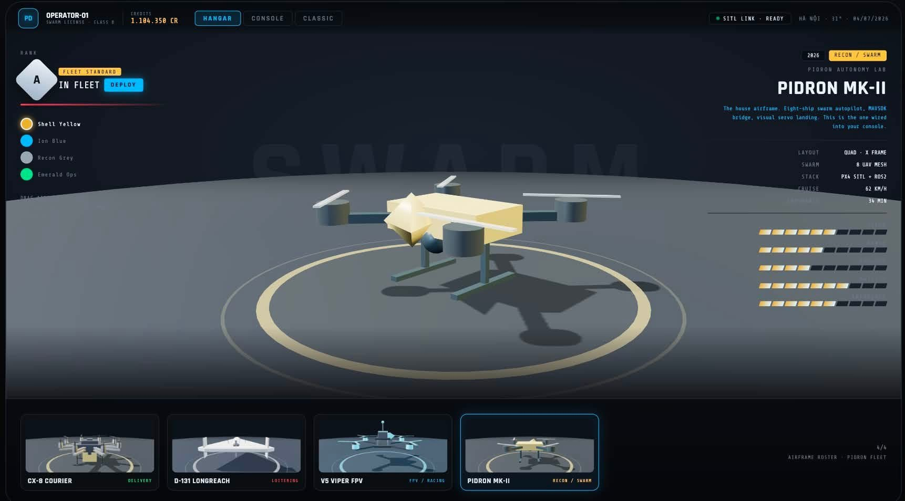
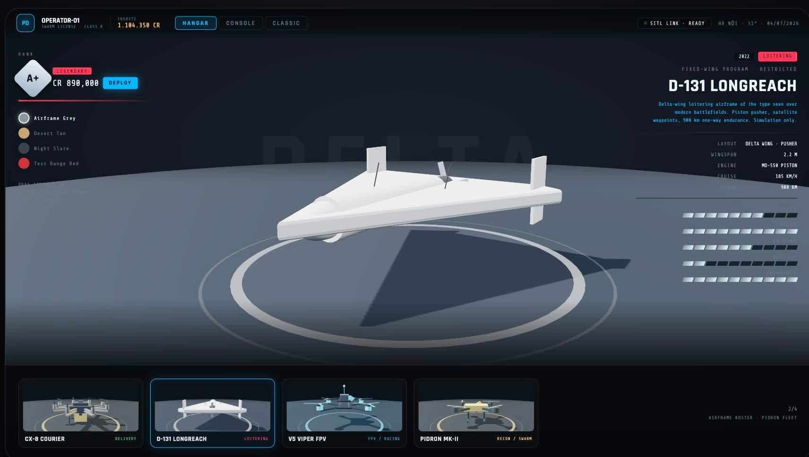
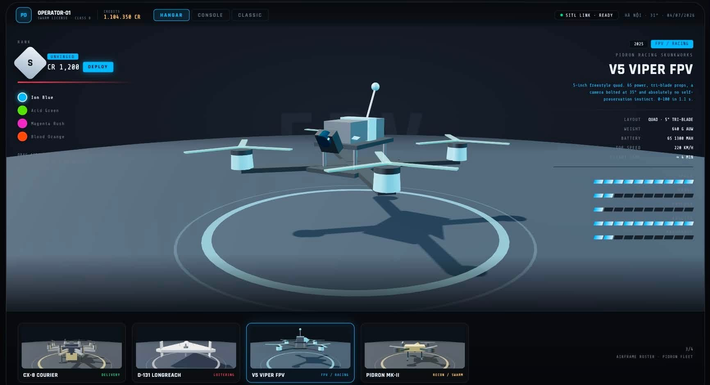
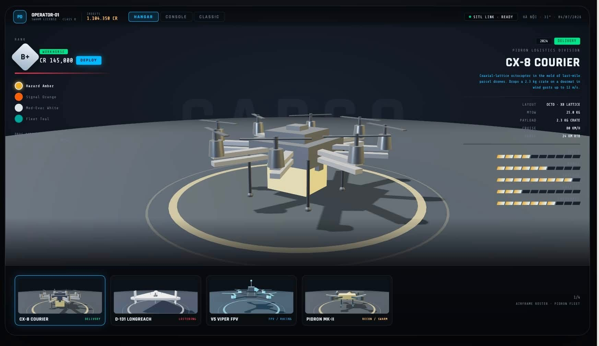

# 🚁 Pidron — SITL Swarm Simulator



> Pidron là một phần mềm mô phỏng bay (Software-in-the-Loop - SITL) dành cho nghiên cứu và phát triển bầy đàn máy bay không người lái (multi-UAV swarm simulator). 

## 🌟 Giới thiệu

Pidron cung cấp một môi trường vật lý thực tế, một hệ thống autopilot dạng module, lớp điều phối bầy đàn (swarm coordination layer) và giao diện trực quan 3D trên nền tảng web. Dự án này được thiết kế chủ yếu cho mục đích nghiên cứu, mô phỏng và kiểm thử các thuật toán điều khiển UAV.

*Lưu ý: Pidron là công cụ dành cho nghiên cứu và mô phỏng. Không sử dụng để điều khiển máy bay thực tế mà không qua các bước kiểm định an toàn và thử nghiệm Hardware-in-the-Loop.*

## ✨ Tính năng chính

*   **Mô phỏng Vật lý (Physics Engine):** Hoạt động ở tần số 200Hz, bao gồm mô hình động cơ, lực cản không khí, nhiễu động gió và tương tác với mặt đất.
*   **Kiến trúc uORB Bus:** Giao tiếp qua kênh pub/sub cho các module điều khiển.
*   **Điều phối bầy đàn (Swarm Coordinator):** Xử lý toán học đội hình (như V-Formation), phân công nhiệm vụ và tránh va chạm (APF).
*   **Giao diện Web 3D (Web UI):** Sử dụng React và Three.js để hiển thị thời gian thực UAV, quỹ đạo bay, và dữ liệu telemetry.
*   **Mô phỏng sự cố (Fault Injection):** Hỗ trợ mô phỏng lỗi động cơ, mất GPS, hoặc nhiễu động gió để kiểm tra khả năng phục hồi của hệ thống.
*   **Ghi và phát lại dữ liệu (Logging & Replay):** Xuất dữ liệu telemetry (định dạng JSON/rosbag-like) để xem lại và phân tích.

## 🛠 Công nghệ sử dụng

*   **Backend:** Rust (Đảm nhận mô phỏng vật lý, Flight runtime, Swarm Coordinator, WebSockets API).
*   **Frontend:** TypeScript, React, Three.js, Vite.
*   **Giao thức:** Custom JSON WebSockets API (không dùng MAVLink ở cấu hình mặc định).

## 🚀 Cài đặt và Chạy thử (Quickstart)

### Yêu cầu hệ thống
*   **Rust:** Phiên bản 1.70 trở lên (Cài đặt qua `rustup.rs`).
*   **Node.js & pnpm:** Node.js 18+, pnpm 8+.

### Các bước thực hiện

1. **Clone repository:**
   ```bash
   git clone https://github.com/yourorg/pidron.git
   cd pidron
   ```

2. **Khởi chạy Backend (Rust):**
   Mở terminal 1 và chạy:
   ```bash
   cargo run --release
   ```
   *Server sẽ lắng nghe tại `ws://127.0.0.1:8080`.*

3. **Khởi chạy Frontend (TypeScript):**
   Mở terminal 2 và chạy:
   ```bash
   pnpm install
   pnpm dev
   ```

4. **Truy cập Giao diện:**
   Mở trình duyệt tại địa chỉ hiển thị trên terminal (thường là `http://localhost:5174` hoặc `http://127.0.0.1:8080`).

## 🎮 Hướng dẫn sử dụng cơ bản

1. Tại giao diện web, nhấn **ARM ALL** để khởi động toàn bộ UAV.
2. Nhấn **TAKEOFF ALL**, các UAV sẽ tự động cất cánh đến độ cao lơ lửng mặc định (5m).
3. Chọn một đội hình bay (ví dụ: `V-Formation`) ở bảng điều khiển bên dưới và nhấn **APPLY** để xem UAV di chuyển vào vị trí.

## 📸 Giao diện và Mô phỏng (Screenshots)





## 📚 Tài liệu tham khảo

Để biết thêm chi tiết về kiến trúc, cách phát triển module mới, và hướng dẫn sử dụng nâng cao, vui lòng xem trong thư mục `doc/`:
*   [`doc/TECHNICAL.md`](doc/TECHNICAL.md) - Kiến trúc kỹ thuật và API.
*   [`doc/TUTORIAL.md`](doc/TUTORIAL.md) - Hướng dẫn các kịch bản mô phỏng nhanh.
*   [`doc/USER_GUIDE.md`](doc/USER_GUIDE.md) - Hướng dẫn sử dụng chi tiết UI và tính năng.
*   [`doc/DEVELOPER_GUIDE.md`](doc/DEVELOPER_GUIDE.md) - Hướng dẫn cho lập trình viên muốn đóng góp mã nguồn.

## 📜 Giấy phép

Vui lòng tham khảo file `LICENSE` trong mã nguồn.
# PidronWorks
