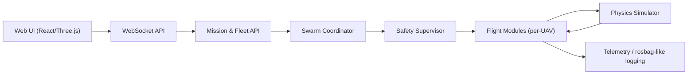

# Pidron — Technical Design

This document describes the architecture, core modules and developer-facing
contracts of the Pidron SITL swarm simulator.

## Overview

Pidron is a Software-in-the-Loop (SITL) flight runtime implemented in Rust with
a web-based frontend (TypeScript + Three.js). It provides a uORB-like pub/sub
bus, per-UAV autopilot stacks and a Swarm Coordinator for multi-UAV scenarios.


## High-level architecture



## Core modules

- Simulation Engine (`server/modules/simulator.rs`): physics loop (200Hz), motor
  models, drag, wind perturbation and ground contact.
- uORB bus (`server/uorb.rs`): asynchronous watch/send channels for module
  communication.
- Commander / Estimator / Controllers (`server/modules/*.rs`): per-UAV flight
  stack (state machine, complementary filter, attitude & position controllers).
- Swarm Coordinator (`server/modules/swarm_coordinator.rs`): formation math,
  assignment and collision avoidance (APF / potential field fallback).
- Safety Supervisor: geofence, emergency limits, battery and failsafe handlers.
- Web API (Axum + WebSocket): exposes telemetry, command endpoints and accepts
  control messages (JSON). Frontend connects by WebSocket for realtime updates.

## Data formats

- Telemetry (example shape):

```json
{
  "type": "telemetry",
  "drones": {
    "uav-01": { "telemetry": {"pos": [x,y,z], "vel": [vx,vy,vz], "battery": 98}, "motor_outputs": [0.1,0.1,0.1,0.1] }
  },
  "selected_id": "uav-01"
}
```

- Commands: `arm`, `takeoff`, `land`, `set_mission`, `set_wind`, `fail_drone` —
  sent as JSON messages over WebSocket. See `server/main.rs` for routing rules.

## Running & development

- Build backend:

```bash
cargo build --release
```

- Run backend (production assets served by Axum):

```bash
cargo run --release
```

- Frontend development (hot reload):

```bash
pnpm install
pnpm dev
# or with npm
npm install
npm run dev
```

When developing, frontend connects to backend via the configured WS proxy.

## Testing

- Rust unit tests: `cargo test` — focus on estimator, controllers and collision
  avoidance math.
- Integration: run `cargo run` then open the UI and exercise multi-UAV scenarios.

## Extending the simulator

- Add a new per-UAV module: create the Rust file in `server/modules/`, publish
  telemetry to uORB, and subscribe from the `main` startup routine.
- Add a new formation in `swarm_coordinator.rs`: compute offsets and emit
  per-UAV setpoints as offboard commands.
- To change the WebSocket API, update `server/main.rs` and ensure the frontend
  `src/simulator.ts` mapping matches the message schema.

## Performance notes

- Physics runs at 200Hz; autopilot loops at 200Hz/100Hz depending on module.
- Scale to 8–12 UAVs on a typical dev machine; use headless mode and lower
  sensor/update frequency to increase capacity.

## Security & safety

- The project uses a custom JSON WS protocol (not MAVLink). Do not expose the
  WS endpoint without a secure network layer and authentication in production.
- Safety Supervisor enforces hard limits; AI modules produce recommendations but
  must be checked by Safety Supervisor before actuator outputs are applied.

---

See the `plan/` directory for roadmap items and pipeline analysis.
